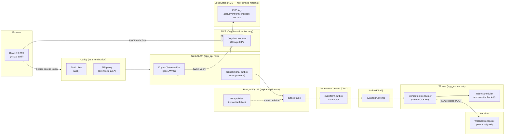

# eventform

Multi-tenant form builder with end-to-end webhook delivery, built to demonstrate
production-grade distributed-systems patterns: transactional outbox, CDC via
Debezium, idempotent Kafka consumer, row-level security, KMS-encrypted secrets,
and Cognito PKCE auth — all runnable locally with a single `docker compose up`.

---

## Architecture



**Delivery guarantee:** at-least-once. Receivers deduplicate on `X-Eventform-Event-Id`
(stable per outbox row UUID). The consumer uses `SELECT ... FOR UPDATE SKIP LOCKED`
so multiple worker replicas never race on the same row.

---

## Patterns on display

| Pattern | Why it matters | Implementing file |
|---|---|---|
| **Transactional outbox** | Submission write and event emit are atomic — no dual-write, no missed events | [`apps/api/src/public/public.service.ts`](apps/api/src/public/public.service.ts) |
| **CDC (Debezium)** | Outbox rows flow to Kafka via the Postgres WAL — zero polling, no extra DB load | [`infra/compose/connect/eventform-outbox.json`](infra/compose/connect/eventform-outbox.json) |
| **Idempotent consumer** | Delivery is marked `delivered` before ACK; re-delivered messages are skipped | [`apps/worker/src/processor/delivery-processor.service.ts`](apps/worker/src/processor/delivery-processor.service.ts) |
| **Row-level security** | Every query runs under a tenant-scoped transaction; no cross-tenant data leaks at the SQL layer | [`packages/db/migrations/0001_rls.sql`](packages/db/migrations/0001_rls.sql) |
| **SKIP LOCKED scheduler** | Retry rows are claimed with `SELECT ... FOR UPDATE SKIP LOCKED` — safe to run N replicas | [`apps/worker/src/scheduler/retry-scheduler.service.ts`](apps/worker/src/scheduler/retry-scheduler.service.ts) |
| **Manual retry (API)** | Operators can re-queue failed deliveries from the dashboard | [`apps/api/src/deliveries/deliveries.service.ts`](apps/api/src/deliveries/deliveries.service.ts) |
| **HMAC webhook signing** | Every delivery carries `X-Eventform-Signature`; receivers verify authenticity | [`packages/shared/src/hmac.ts`](packages/shared/src/hmac.ts) |
| **KMS-encrypted secrets** | Endpoint HMAC secrets are AES-GCM encrypted at rest; LocalStack provides the key locally | [`packages/shared/src/kms.ts`](packages/shared/src/kms.ts) |
| **PKCE auth** | SPA uses authorization-code + PKCE flow against Cognito hosted UI — no client secret in the browser | [`apps/web/src/lib/pkce.ts`](apps/web/src/lib/pkce.ts) |
| **Cognito token verifier** | API verifies RS256 access tokens via remote JWKS; test seam accepts a local keypair (no AWS needed in CI) | [`apps/api/src/auth/cognito-token-verifier.ts`](apps/api/src/auth/cognito-token-verifier.ts) |

**Honest notes:**
- Delivery is **at-least-once, not exactly-once.** Webhook receivers should deduplicate
  on `X-Eventform-Event-Id` if they require idempotency.
- The Debezium connector uses the admin DB user in this demo (no dedicated replication
  role). A production hardening step would create a minimal-privilege replication role.
- **KMS threat model:** root of trust is `KMS_KEY_MATERIAL_FILE` on the host (mode 600,
  backed up out-of-band). A DB dump without the key material file is ciphertext-only.
  LocalStack Community reports `Origin=AWS_KMS` — the `EXTERNAL` origin CDK declaration
  is honoured at the CloudFormation level; material is always imported by the boot hook.

---

## Local quickstart

**Prerequisites:** Node >= 22, pnpm, Docker.

```bash
git clone https://github.com/murugu21/eventform
cd eventform
pnpm install
pnpm build
cp .env.example .env

pnpm db:up            # postgres + localstack (KMS) + kafka + kafka-connect
pnpm db:migrate       # apply all Drizzle migrations (tables, roles, RLS)
pnpm connect:register # register the Debezium outbox connector

# Terminal 1 — API
PORT=3001 node apps/api/dist/main.js

# Terminal 2 — worker
node apps/worker/dist/main.js

# Terminal 3 — web dev server
pnpm --filter @eventform/web dev
# => http://localhost:5173
```

---

## Demo walkthrough

1. Go to [http://localhost:5173](http://localhost:5173) and click **Sign in**.
   Enter **any handle** (e.g. `alice`) — dev mode requires no password and no Cognito.

2. **Dashboard** → **New form** → enter a title → **Create**.

3. **Form builder** → **Add field** → set label to `Name` → **Save fields** → **Publish**.
   Copy the public `/forms/<slug>` URL shown in the publish confirmation.

4. **Endpoints** → **New endpoint** → name it, set the URL to any POST-accepting target
   (e.g. [webhook.site](https://webhook.site), or `nc -l 9099`) → **Create** → copy and
   save the `whsec_...` secret → close the dialog.

5. Open the `/forms/<slug>` URL in a new tab, fill in the **Name** field, click **Submit**.
   You should see "Response recorded."

6. Return to **Deliveries** — the row flips from `pending` to `delivered` within ~5 s.
   To demo failure + retry: delete the endpoint URL, submit again, watch the delivery
   fail, then restore the URL and click **Retry**.

---

## Test inventory

| Suite | Tests | What it covers |
|---|---|---|
| `packages/shared` | 28 | HMAC signing/verification, event schemas (Zod), KMS encrypt/decrypt (integration, LocalStack) |
| `packages/db` | 12 | RLS policies (integration, real Postgres) |
| `apps/api` | 60 | e2e API routes (NestJS test app), Cognito JWT verifier (local JWKS keypair), zod pipe, exception filter |
| `apps/worker` | 22 | delivery processor, retry scheduler (SKIP LOCKED), backoff, pipeline e2e (real Kafka) |
| `apps/web` | 17 | PKCE helpers (RFC 7636 vectors), API client, Cognito callback |
| `infra/cdk` | 14 | AuthStack + KmsStack CloudFormation template assertions (no AWS) |
| **Total** | **153** | unit + integration |
| **Playwright smoke** | 1 | full loop: sign in → build form → publish → anonymous submit → delivery delivered |

Run all unit/integration suites:
```bash
pnpm test
```

Run the Playwright smoke (requires API + worker + compose stack up):
```bash
pnpm --filter @eventform/web exec playwright test
```

---

## Deployment

See [docs/DEPLOYMENT.md](docs/DEPLOYMENT.md) for the step-by-step handoff checklist
(AWS/Cognito setup, VPS provisioning, first-time bootstrap, CI/CD secrets).

**Cost summary (running in production):**
- VPS (Hetzner CX22 or equivalent): ~€4–6/month
- AWS Cognito: $0 (50 000 MAU free tier)
- AWS KMS: $0 (LocalStack runs on the VPS — no AWS KMS calls in prod)
- Domain: already owned

---

## Repo layout

```
packages/shared   HMAC utils, Zod event schemas, KMS cipher
packages/db       Drizzle schema, migrations, tenant-scoped tx helper
apps/api          NestJS REST API — auth, forms, endpoints, public submission, deliveries
apps/worker       Kafka consumer + webhook delivery — idempotent, at-least-once, auto-retry
apps/web          React 19 + shadcn/ui SPA — form builder, dashboard, Playwright smoke
infra/compose     docker-compose.yml (dev) + docker-compose.prod.yml (prod)
infra/caddy       Dockerfile + Caddyfile for TLS termination + static file serving
infra/cdk         AWS CDK: AuthStack (Cognito) + KmsStack (LocalStack KMS)
infra/prod        bootstrap.sh — first-boot hardening
.github/workflows ci.yml (tests) + deploy.yml (GHCR images + VPS SSH deploy)
docs/DEPLOYMENT.md  Human handoff checklist
```

## Auth modes

| Mode | How it works | When to use |
|---|---|---|
| `AUTH_MODE=dev` | `Bearer dev_<sub>` tokens, no signature, sub extracted from header | Local development only |
| `AUTH_MODE=cognito` | RS256 access tokens verified via Cognito JWKS endpoint | Staging and production (pinned in prod compose) |

Prod compose hard-pins `AUTH_MODE=cognito` — dev tokens are impossible in production.
