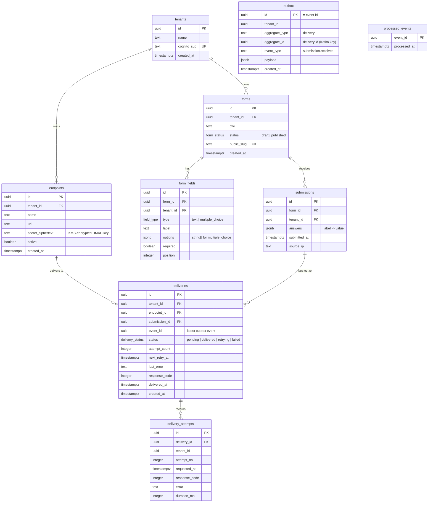

# Eventform — Design Spec

**Date:** 2026-06-11
**Status:** Approved (brainstorming complete)

## What it is

A multi-tenant form builder with webhook delivery, built as a portfolio project to
(1) be a genuinely usable tool and (2) showcase event-driven architecture to recruiters.
A signed-in tenant builds a form, shares a public link, anonymous respondents submit,
and each submission is delivered to the tenant's webhook endpoints as an HMAC-signed
event flowing through a transactional-outbox → Debezium CDC → Kafka → idempotent
consumer pipeline. Failed deliveries surface in a UI with manual retry.

- App: `https://eventform.murugappan.dev`
- API: `https://eventform-api.murugappan.dev`
- Runs on one ≥2 GB VPS (any provider) via docker-compose.
- Repo is public on GitHub, pinned on the profile. The README is part of the product.

## Decisions made during brainstorming

| Question | Decision |
|---|---|
| Product loop | Mini-Typeform: build form → public link → submissions → webhooks |
| Tenancy | 1 Google user = 1 tenant, auto-created on first login |
| "Row based lock" | Both: Postgres RLS for isolation **and** `FOR UPDATE [SKIP LOCKED]` for concurrency |
| Manual retry path | Re-emitted through the outbox → same Kafka pipeline (not direct from API) |
| Auto retries | 3 attempts (5s / 30s / 2m backoff), then `failed` → manual retry |
| Demo webhook target | External URLs only (e.g., webhook.site) — no built-in inspector |
| Field types | Short text + multiple choice only |
| LocalStack | Dev: CDK testing (`cdklocal`) + KMS. Prod: runs on the EC2 too, **KMS only** |
| HMAC secret storage | Never plaintext at rest — KMS-encrypted (LocalStack KMS in dev *and* prod); fixed key material re-imported at boot since Community edition has no persistence |
| Cognito | Real AWS Cognito (free tier) — LocalStack Community cannot emulate it |
| Hosting | Any Docker-capable VPS with ≥2 GB RAM (Hetzner/DO/Vultr/...) — cheaper than EC2, zero compute lock-in; the prod compose stack is provider-agnostic. (Superseded the original EC2 plan 2026-06-11.) |
| ORM | Drizzle (SQL-first, clean RLS integration via per-tx `SET LOCAL`) |
| Architecture | Approach A: two Nest apps; all delivery attempts flow through the outbox |

## Repo layout (pnpm workspaces monorepo)

```
eventform/
├── apps/
│   ├── web/        React + Vite + shadcn/ui (static build served by Caddy)
│   ├── api/        NestJS — REST API, auth guard, public submission endpoint
│   └── worker/     NestJS — Kafka consumer, retry scheduler, webhook sender
├── packages/
│   └── shared/     event payload schemas (zod), HMAC sign/verify util, shared types
├── infra/
│   ├── cdk/        AWS CDK app (TypeScript): AuthStack + ComputeStack
│   └── compose/    docker-compose.yml, prod override, Caddyfile, Debezium connector JSON
└── docs/
```

## Runtime topology (7 containers on the EC2)

| Container | Role | Notes |
|---|---|---|
| caddy | TLS (Let's Encrypt) for both domains; serves `web` static files; proxies API | |
| api | NestJS REST API | non-superuser DB role → RLS enforced |
| worker | Kafka consumer + retry scheduler + webhook HTTP sender | trusted internal role (bypasses RLS, scopes explicitly) |
| postgres | Postgres 16, `wal_level=logical` | |
| kafka | Single-node Kafka 3.x in KRaft mode (no ZooKeeper), small heap | |
| connect | Kafka Connect + Debezium Postgres connector (pgoutput) | outbox event router SMT |
| localstack | KMS only (`SERVICES=kms`) — encrypts endpoint HMAC secrets at rest | boot hook re-imports fixed key material (Community edition has no persistence) |

## Data model

All tables carry `tenant_id` and an RLS policy unless noted.

### ER diagram



`outbox` and `processed_events` stand apart deliberately: `outbox` rows are
transient envelopes captured by Debezium (no FKs so cleanup never contends with
domain rows), and `processed_events` is the consumer's idempotency ledger keyed
by event id alone.

```
tenants           id, name, cognito_sub (unique), created_at        — no RLS (lookup table)
forms             id, tenant_id, title, status(draft|published), public_slug (unique), created_at
form_fields       id, form_id, tenant_id, type(text|multiple_choice), label,
                  options jsonb, required, position
submissions       id, form_id, tenant_id, answers jsonb, submitted_at, source_ip
endpoints         id, tenant_id, name, url, secret_ciphertext (KMS-encrypted), active
outbox            id uuid (= event id), tenant_id, aggregate_type, aggregate_id,
                  event_type, payload jsonb, created_at              — Debezium source; periodic cleanup
processed_events  event_id (PK), processed_at                        — consumer idempotency; no RLS
deliveries        id, tenant_id, endpoint_id, submission_id, event_id,
                  status(pending|delivered|retrying|failed), attempt_count,
                  next_retry_at, last_error, response_code, delivered_at
delivery_attempts id, delivery_id, tenant_id, attempt_no, requested_at,
                  response_code, error, duration_ms
```

### Multi-tenancy

- Cognito JWT `sub` → `tenants` row (auto-created on first login).
- Every API request runs queries inside a transaction beginning with
  `SET LOCAL app.tenant_id = '<uuid>'`.
- RLS policy on each tenant table: `tenant_id = current_setting('app.tenant_id')::uuid`.
- API connects as a dedicated non-superuser role so policies actually apply.
- Worker uses its own role with RLS bypass but always filters by tenant explicitly.

### Row locks

- Retry scheduler claims due work: `SELECT … FOR UPDATE SKIP LOCKED LIMIT 10`.
- Consumer updates a delivery under `FOR UPDATE`, so a manual retry racing an
  in-flight auto attempt cannot double-send.

### Endpoint secret encryption (KMS)

Webhook HMAC secrets are never stored in plaintext.

- **Generation:** API creates `whsec_<48 hex chars>` on endpoint create/rotate.
- **Encryption:** `KMS Encrypt` against key `alias/eventform-endpoint-secrets`
  with `EncryptionContext: { tenantId }` — a ciphertext copied across tenants
  fails to decrypt. The base64 ciphertext blob is what lands in
  `endpoints.secret_ciphertext`.
- **Decryption:** the API decrypts on demand for the "reveal secret" UI; the
  worker decrypts before signing, with a ≤5-minute in-memory cache keyed by
  endpoint id (invalidated on rotate by ciphertext change).
- **KMS provider:** LocalStack KMS in dev *and* prod (a `SERVICES=kms`
  container on the EC2). LocalStack Community has no persistence, so a boot
  hook (`init/ready.d`) recreates the key with a fixed custom key id
  (`_custom_id_` tag) as `Origin=EXTERNAL` and re-imports **fixed key
  material** (BYOK `ImportKeyMaterial` flow) from a file: checked-in dev
  material locally; a once-generated, root-only file on the EC2 host in prod.
  Same key id + same material ⇒ old ciphertexts decrypt after every restart.
- **Honest threat model (README talking point):** with LocalStack the
  effective root of trust is the key-material file on the host, so this is
  equivalent in strength to a host-held master key — the genuine win is that a
  DB dump, backup, or SQL-injection read no longer exposes webhook secrets,
  while the code path stays byte-for-byte compatible with real AWS KMS
  (swap the endpoint URL, drop the boot hook).

## Event flow

### Submission (dual-write fix)

1. `POST /f/:slug` validates answers against the form definition.
2. One DB transaction inserts the `submissions` row **and** one `outbox` row per
   active endpoint (plus the corresponding `deliveries` row in `pending`).
   No separate publish step exists — this is the transactional outbox.
3. Outbox payload: event id (= outbox id), tenant id, form id/title, submission id,
   answers, endpoint id, attempt number.

### CDC → Kafka

- Debezium Postgres connector (logical replication, `pgoutput`) watches `outbox`.
- Outbox Event Router SMT routes all events to topic `eventform.events`;
  message key = `aggregate_id` (the delivery id) so attempts for one delivery are ordered.
- Outbox rows are deleted by a periodic worker cleanup job (Debezium reads the WAL,
  so deletion after capture is safe).

### Consumer (worker) — at-least-once + idempotency

Consumer group `eventform-worker`; offsets committed manually **after** handling.

Per message:
1. Begin DB transaction.
2. `INSERT INTO processed_events (event_id) … ON CONFLICT DO NOTHING` —
   zero rows inserted ⇒ redelivery already handled ⇒ commit, ack, skip.
3. `SELECT … FROM deliveries WHERE id = $aggregate_id FOR UPDATE` —
   skip if status already terminal (`delivered`/`failed`).
4. HTTP POST to the endpoint (10s timeout) with headers:
   - `X-Eventform-Event-Id`
   - `X-Eventform-Timestamp`
   - `X-Eventform-Signature: sha256=HMAC_SHA256(secret, timestamp + "." + rawBody)`
     (secret decrypted via KMS, cached in memory ≤5 min)
5. Record `delivery_attempts` row; update delivery:
   - 2xx → `delivered`
   - failure & attempt < 3 → `retrying`, `next_retry_at = now() + (5s|30s|2m)`
   - failure & attempt = 3 → `failed`
6. Commit DB transaction, then commit the Kafka offset.

A crash between the HTTP call and commit rolls back the idempotency claim, so the
redelivered message re-sends the webhook — that is the documented at-least-once
semantics. Receivers dedupe on `X-Eventform-Event-Id`. The row lock is held during
the HTTP call (max 10s); acceptable at this scale and what makes the retry-race
protection real.

### Retries — everything goes back through the pipeline

- **Auto:** scheduler in the worker (every 5s) claims due `retrying` deliveries with
  `FOR UPDATE SKIP LOCKED`, inserts a fresh outbox row (new event id, attempt n+1),
  sets the delivery back to `pending`. Flows through Debezium → Kafka → consumer again.
- **Manual:** `POST /deliveries/:id/retry` (only when `failed`) resets the attempt
  budget and inserts an outbox row the same way. Identical pipeline, identical
  idempotency. "Even retries are events."

## Auth

- CDK `AuthStack`: Cognito user pool, hosted UI domain, Google federated IdP
  (Google OAuth client created manually in Google Cloud Console; id/secret passed
  as CDK context/secrets), app client with callback
  `https://eventform.murugappan.dev/auth/callback` (+ `http://localhost:5173/auth/callback` for dev).
- SPA uses OAuth authorization-code + PKCE against the hosted UI; tokens in memory
  with refresh rotation.
- API: Nest guard validates the access-token JWT against the pool JWKS.
- Public endpoints (no auth): `GET /f/:slug` form definition, `POST /f/:slug` submit.

## Frontend pages (React + Vite + shadcn/ui)

| Page | Contents |
|---|---|
| Landing | Recruiter pitch: blurb, architecture diagram, "Sign in with Google" |
| Dashboard | Form list + create |
| Form builder | Title; ordered fields (text / multiple choice + options, required); publish → public link |
| Public form | Render published form, validate, submit, thank-you state |
| Submissions | Table per form: answers, submitted_at |
| Endpoints | CRUD endpoints; show/rotate HMAC secret; signature-verification code snippet |
| Deliveries | Failed-events UI: filter by status/endpoint; expandable attempt history (code, error, duration); Retry button on failed; polling auto-refresh |

## Infra

### CDK (TypeScript, two stacks)

- **AuthStack** — Cognito pool + hosted domain + Google IdP + app client
  (deployed to real AWS — Cognito free tier; the only real-AWS resource).
- **KmsStack** — the endpoint-secret KMS key + alias, deployed via `cdklocal`
  into the LocalStack container (dev and prod-VPS alike); the compose boot hook
  remains as the idempotent material-import + resilience mechanism.
- Compute is NOT CDK-managed: the prod docker-compose stack runs on any VPS;
  provisioning is a documented checklist + optional cloud-init snippet.
  (ComputeStack dropped with the EC2→VPS pivot, 2026-06-11.)

### LocalStack

- **Dev:** compose includes a LocalStack container serving KMS, and `cdklocal
  deploy` exercises the CDK code against it. Cognito resources sit behind a CDK
  context flag (`-c auth=off`) since LocalStack Community cannot emulate
  Cognito; local dev either uses a dev-mode JWT bypass or points at the real
  dev user pool.
- **Prod:** the EC2 compose runs LocalStack with `SERVICES=kms` only, as the
  encryption provider for endpoint secrets (see *Endpoint secret encryption*).
  The boot hook re-imports fixed key material from
  `/etc/eventform/kms-key-material.b64` (generated once by the Phase 5
  bootstrap, mode 600).

### CI/CD (GitHub Actions)

lint + test → build images → push GHCR → SSH/SSM to EC2 → `docker compose pull && up -d`.

## Error handling

- Consumer: unexpected exception ⇒ DB tx rolls back, offset not committed ⇒ redelivery.
- Webhook failures are data, not errors: recorded as attempts, drive the retry state machine.
- Public submit endpoint rate-limited (per-IP) to keep the demo box healthy.
- Worker and API expose `/health`; compose restarts unhealthy containers.

## Testing

- **Unit:** HMAC sign/verify, answer validation, retry backoff math, payload schemas.
- **Integration (Testcontainers: Postgres + Kafka + Debezium Connect):**
  - outbox insert → message lands on `eventform.events`
  - duplicate Kafka delivery → exactly one webhook sent (idempotency)
  - concurrent manual retry + auto attempt → single send (row lock)
  - RLS: tenant A cannot read tenant B's rows via the API role
- **E2E:** Playwright smoke — login-bypassed dev mode: create form → publish →
  submit publicly → delivery appears.

## README (deliverable, not afterthought)

Architecture mermaid diagram; pattern-by-pattern tour (outbox, CDC, at-least-once +
idempotency, RLS, row locks, HMAC) each linking to the implementing file; "try it
yourself" walkthrough using webhook.site; local dev quickstart; cost notes.

## Out of scope (YAGNI)

Orgs/teams/roles, more field types, built-in webhook inspector, Kafka retry topics,
multi-node Kafka, payload transformation, endpoint-level event filtering, email
notifications, analytics.
